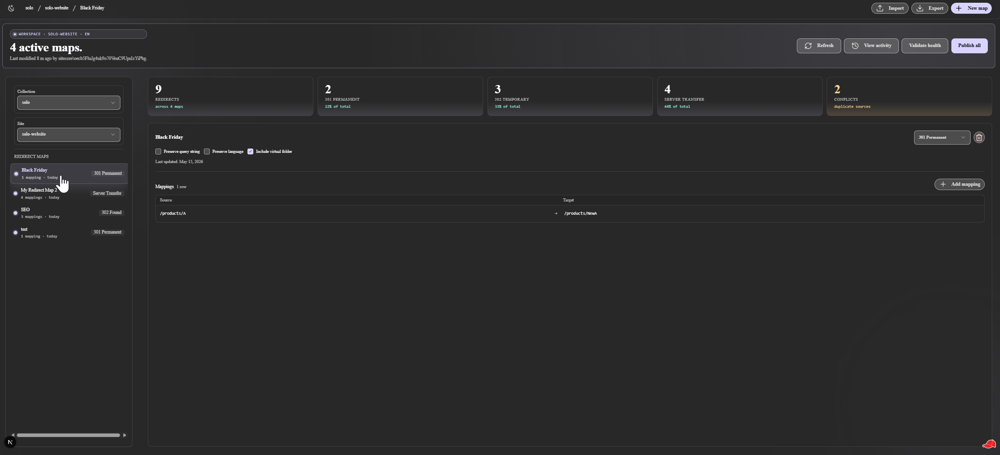
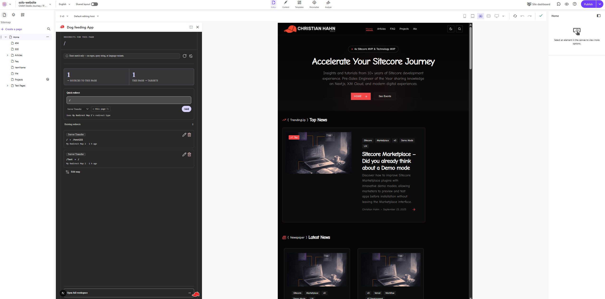
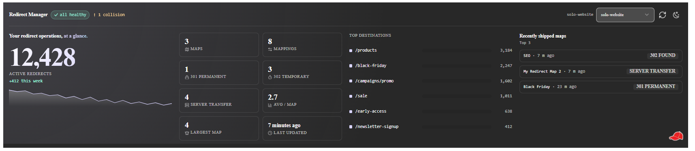

#  Redirect Manager

**Author:** [Christian Hahn](https://www.linkedin.com/in/christian-hahn-solo/) — _Technical Product Manager DevEx & SDKs @ Sitecore_

A Sitecore Marketplace client-side app that gives content authors and site managers a purpose-built UI for redirect operations across a SitecoreAI tenant. Replaces the Content Editor workflow for managing items under `/sitecore/content/{COLLECTION}/{SITE}/Settings/Redirects/*` and surfaces redirects inside the Pages editor, on the site dashboard, and on a dedicated full-page workshop.

<p align="center">
  
</p>

## What this does

Redirect Manager exposes three Cloud Portal extension points, all backed by Sitecore Authoring GraphQL:

- **Context Panel** — inside the Pages editor, lists every redirect affecting the current page (exact source/target match), with inline add / edit / delete.
- **Dashboard Widget** — at-a-glance tiles (Maps / Mappings / 301 / 302 / Server Transfer / Avg per map / Largest map / Last updated), collision badges, top-destinations bar list, and recently-shipped maps.
- **Full Page** — virtualized Redirect Map list, full CRUD with drag-reorder, JSON import / export keyed by Sitecore item GUID, conflict resolver, and a real **Publish Site** button wired to the SitecoreAI Publishing v1 API (PRD-003).

Redirects are shared across all language versions of a site — `UrlMapping` is a SHARED Sitecore field (no language axis). See [docs/features.md](docs/features.md) for per-surface deep-dives.

## Screenshots

<p align="center">
  
</p>

<p align="center">
  
</p>

## Tech stack

| Layer | Choice |
|---|---|
| Scaffold | `sitecore:setup-marketplace-client-side` (Mode A) |
| Framework | Next.js App Router `next@16.x` + React 19 |
| SDK | `@sitecore-marketplace-sdk/client` + `@sitecore-marketplace-sdk/xmc` |
| UI | Blok primitives via shadcn registry, Tailwind v4, lucide icons |
| Data | Sitecore Authoring GraphQL via `xmc.authoring.graphql` |
| Publish | SitecoreAI Publishing v1 REST — server-side OAuth proxy route (ADR-0035) |
| State / forms | `react-hook-form`, `zod` v4, `sonner` |
| Lists / drag | `react-virtuoso`, `@dnd-kit/core` + `@dnd-kit/sortable` |
| Tests | Vitest + `@testing-library/react` + jsdom + `fast-check` |

Scaffold command and ADR: [ADR-0002](project-planning/ADR/adr-0002-marketplace-sdk-mode-a-scaffold.md).

## Quickstart

Marketplace apps require HTTPS — Cloud Portal enforces secure-context constraints. See the `sitecore:marketplace-sdk-testing-debug` skill for the full mkcert / Local Network Access setup.

1. **Install Node** — version pinned by `site/package.json` (Next 16 + React 19 toolchain).
2. **Install mkcert** — trusted root CA for `https://localhost`.
3. **Register a Cloud Portal Test App** — see [`site/docs/registration.md`](site/docs/registration.md). Map three extension points:
   - `xmc:pages:contextpanel` → `/context-panel`
   - `xmc:dashboardblocks` → `/dashboard-widget`
   - `xmc:fullscreen` → `/full-page`
4. **Provision a SitecoreAI tenant** with Authoring GraphQL write access on `Settings/Redirects` items.
5. **For Publish Site only** — register an automation client (`xmcloud.cm:admin` + `xmcpub.jobs.a:r` + `xmcpub.jobs.a:w`); see [docs/operations.md](docs/operations.md).

```bash
cd site
npm install
cp .env.example .env.local   # populate from Cloud Portal Test App
npm run dev                  # boots at https://localhost:3000
```

Open the registered Test App and navigate to any of the three extension-point routes.

### Common commands

```bash
npm run dev          # dev server with Turbopack
npm run build        # production build
npm run lint         # ESLint
npm run typecheck    # tsc --noEmit
npm run test         # Vitest single-pass
npm run test:watch   # Vitest watch mode
```

## Project structure

```
products/redirect-manager/
├── README.md
├── CHANGELOG.md
├── docs/
│   ├── architecture.md      ← system narrative + PRD-002/003 additions
│   ├── decisions.md         ← ADR summary table (ADR-0001 – ADR-0037)
│   ├── features.md          ← per-surface deep-dives with screenshots
│   ├── operations.md        ← known limitations + smoke checklists
│   └── screenshots/
├── pocs/                    ← POC clickdummies (PRD-000, PRD-002)
├── project-planning/        ← PRDs, ADRs, task breakdowns, manifests
└── site/                    ← implementation
    ├── app/
    │   ├── context-panel/
    │   ├── dashboard-widget/
    │   ├── full-page/
    │   └── api/publish/     ← server-side OAuth proxy (PRD-003)
    ├── components/
    ├── hooks/
    ├── lib/
    │   ├── sdk/             ← typed SDK wrappers
    │   ├── publish/         ← publish service module (PRD-003)
    │   ├── url-mapping/     ← parse + serialize per ADR-0008
    │   └── import-export/
    ├── styles/
    └── tests/
```

## Configuration

| Variable | Required | Description |
|---|---|---|
| `NEXT_PUBLIC_XMC_COMPONENT_HOST` | Yes | XM Cloud component host URL |
| `NEXT_PUBLIC_XMC_EDGE_URL` | Yes | Edge delivery URL |
| `SITECORE_PUBLISH_CLIENT_ID` | Publish only | OAuth client ID for SitecoreAI Publishing |
| `SITECORE_PUBLISH_CLIENT_SECRET` | Publish only | OAuth client secret |
| `NEXT_PUBLIC_SHOW_THEME_TOGGLE` | No | Set to `1` to show the 3-state theme toggle |

Copy `.env.example` to `.env.local` — all variables with defaults are pre-filled.

## Architecture in three paragraphs

The app is a **client-side Marketplace app (Mode A)**. Every Sitecore read/write call rides the operator's authenticated Cloud Portal session — no server-side OAuth proxy, no backend to provision, except for the single publishing carve-out below.

All redirect data flows through **Authoring GraphQL via `xmc.authoring.graphql`** — one canonical source for reads and writes. The `UrlMapping` field is a URL-encoded string of `source=target` pairs; the app parses, edits, and re-serializes it losslessly (property-based tested). JSON import / export uses a versioned schema (`redirect-manager/v1`) keyed by Sitecore item GUID.

**PRD-003 added one server-side route** (`app/api/publish/route.ts`) — a narrow carve-out from ADR-0002 documented in ADR-0035. It holds OAuth client-credentials and proxies to the SitecoreAI Publishing v1 API; all other Sitecore calls remain Mode A. The route includes lightweight job-status polling and cross-session resume so operators see live elapsed time and can reload the tab mid-publish without losing the in-flight job.

For the full narrative see [`docs/architecture.md`](docs/architecture.md). For the decision log see [`docs/decisions.md`](docs/decisions.md).

## Where to read more

| Document | Contents |
|---|---|
| [docs/architecture.md](docs/architecture.md) | Full system narrative, data flow, SDK wire shapes, PRD-002/003 additions |
| [docs/decisions.md](docs/decisions.md) | ADR summary table (ADR-0001 – ADR-0037) grouped by theme |
| [docs/features.md](docs/features.md) | Dashboard Widget / Context Panel / Full Page deep-dives with screenshots |
| [docs/operations.md](docs/operations.md) | Known limitations, smoke checklists, publish-credential setup |
| [CHANGELOG.md](CHANGELOG.md) | Per-PRD release notes and roadmap |
| [project-planning/ADR/](project-planning/ADR/) | Individual ADR files with full rationale |

## License

Internal — distribution policy TBD.
