# Redirect Manager

A Sitecore Marketplace client-side app that gives content authors, site managers, and Sitecore implementers a purpose-built UI for redirect operations across an XM Cloud tenant. It replaces the awkward Content-Editor workflow for managing items under `/sitecore/content/{COLLECTION}/{SITE}/Settings/Redirects/*` and surfaces redirects where editors already work — inside the Pages editor, on the site dashboard, and on a dedicated full-page workshop.

<p align="center">
  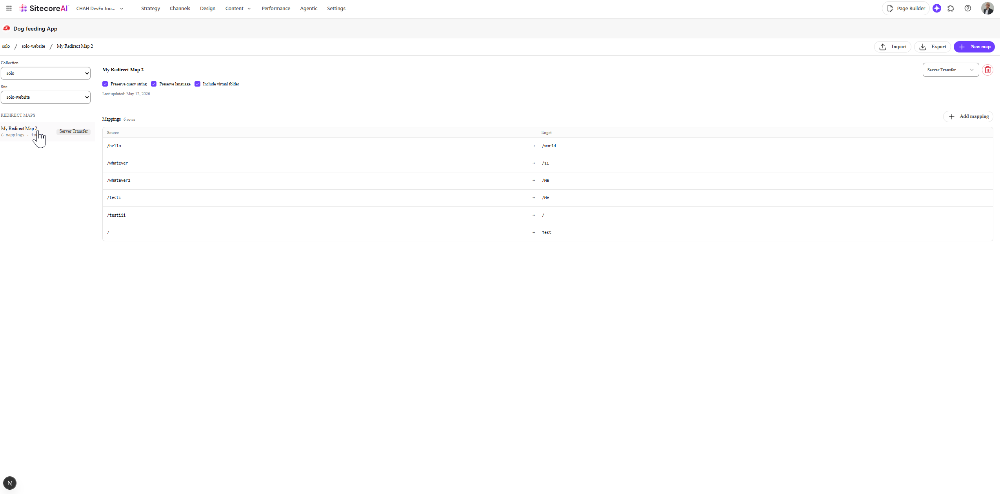
</p>
<p align="center">
  
</p>
<p align="center">
  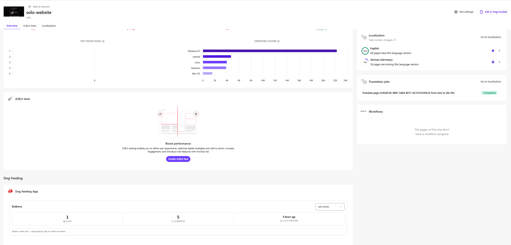
</p>

## What this does

Redirect Manager exposes three Cloud Portal extension points, all backed by a single canonical data source — Sitecore Authoring GraphQL.

- **Context Panel** in the Pages editor. For the page being edited, list every redirect that affects it (where this page is the source OR target by exact-string match), grouped by parent Redirect Map. Add, edit, and delete inline without leaving Pages.
- **Dashboard Widget** on a site dashboard. Three at-a-glance count tiles — Redirect Map items, individual mappings, last-updated timestamp. Site picker at the top right (the SDK does not surface "current site" today; pick once and the widget remembers it via `localStorage`).
- **Full Page** workshop. Site-collection + site picker, virtualized Redirect Map list, full item and mapping CRUD with drag-reorder, JSON import / export keyed by Sitecore item GUID with a per-conflict three-action picker (create / overwrite / skip).

MVP operates in the default content language `en` only. Multilingual CRUD, usage analytics (hit counters, broken-vs-healthy), template sync-back, regex matching, and concurrent-edit detection are all deferred to follow-on PRDs.

## Tech stack

| Layer | Choice |
|---|---|
| Scaffold | `sitecore:setup-marketplace-client-side` (Mode A only) — no server-side OAuth proxy |
| Framework | Next.js App Router on `next@16.x` + React 19 |
| SDK | `@sitecore-marketplace-sdk/client` + `@sitecore-marketplace-sdk/xmc` (versions pinned in `site/package.json`) |
| UI | Blok primitives via shadcn registry, Tailwind v4, lucide icons |
| Data | Sitecore Authoring GraphQL via `xmc.authoring.graphql` |
| State / forms | `react-hook-form`, `zod` v4, `sonner` for toasts |
| Lists | `react-virtuoso` for the redirect-map list |
| Drag-reorder | `@dnd-kit/core` + `@dnd-kit/sortable` |
| Tests | Vitest + `@testing-library/react` + jsdom + `fast-check` for property-based tests |

The scaffold ADR is [ADR-0002](project-planning/ADR/adr-0002-marketplace-sdk-mode-a-scaffold.md); the scaffold command itself is recorded there. Architecture variant rationale lives in [`docs/architecture.md`](docs/architecture.md).

## Getting started

### Prerequisites

Marketplace apps cannot run at plain `http://localhost` — Cloud Portal embeds the iframe over HTTPS and the parent enforces secure-context constraints. See the `sitecore:marketplace-sdk-testing-debug` skill for the full setup (mkcert root CA, Chrome Local Network Access, etc).

1. **Node** — version pinned by `site/package.json` (Next 16 + React 19 toolchain).
2. **mkcert** — local trusted root CA for `https://localhost`.
3. **A Cloud Portal Test App registration** — see [`site/docs/registration.md`](site/docs/registration.md) for the runbook. You need three extension-point entries mapped to:
   - `xmc:pages:contextpanel` → `/context-panel`
   - `xmc:dashboardblocks` → `/dashboard-widget`
   - `xmc:fullscreen` → `/full-page`
4. **An XM Cloud tenant** where the Cloud Portal user has Authoring GraphQL write access on `Settings/Redirects` items.

### Install and run

```bash
cd site
npm install
cp .env.example .env.local   # populate with values from your Cloud Portal Test App
npm run dev                  # boots Next on https://localhost:3000
```

Open the registered Cloud Portal Test App and navigate to one of the three extension points to load the corresponding route.

### Common commands

```bash
npm run dev          # dev server with Turbopack
npm run build        # production build
npm run lint         # ESLint (Next + Blok overrides)
npm run typecheck    # tsc --noEmit
npm run test         # Vitest single-pass
npm run test:watch   # Vitest watch mode
```

## Project structure

```
products/redirect-manager/
├── README.md                ← you are here
├── CHANGELOG.md             ← release entries derived from /ship reports
├── docs/                    ← architecture narrative + decision log
│   ├── architecture.md
│   ├── decisions.md
│   └── screenshots/         ← README screenshots (drop your captures here)
├── pocs/poc-v1/             ← canonical UI variant POC clickdummy
├── project-planning/        ← PRDs, ADRs, task breakdowns, run manifests (operational)
│   ├── PRD/
│   ├── ADR/
│   ├── architecture/
│   ├── plans/
│   ├── ui-design/
│   └── workflow/
└── site/                    ← implementation
    ├── app/
    │   ├── context-panel/page.tsx
    │   ├── dashboard-widget/page.tsx
    │   └── full-page/page.tsx
    ├── components/
    │   ├── context-panel/
    │   ├── dashboard-widget/
    │   ├── full-page/
    │   ├── providers/marketplace.tsx
    │   └── ui/              ← Blok primitives
    ├── lib/
    │   ├── sdk/             ← typed SDK wrappers (the boundary)
    │   ├── domain/
    │   ├── url-mapping/     ← parse + serialize per ADR-0008
    │   ├── import-export/
    │   ├── match/
    │   └── redirects/
    ├── docs/                ← operator-facing smoke checklists + registration runbook
    └── tests/
        ├── fixtures/graphql/   ← real-tenant captures
        ├── structural/
        ├── ui/
        └── unit/
```

## Architecture in three paragraphs

The app is a **client-side Marketplace app (Mode A)**. Every Sitecore call rides the operator's authenticated Cloud Portal session — there is no server-side OAuth proxy, no `experimental_createXMCClient`, no backend the operator must provision. Three Next.js App Router routes are registered against three Cloud Portal extension points; the root route returns `notFound()` so the iframe URL cannot be abused as a standalone page.

All redirect data flows through **Authoring GraphQL via `xmc.authoring.graphql`** — a single canonical source for reads and writes. There is no KV cache, no parallel datastore, no analytics layer in MVP. Site and collection discovery uses `xmc.sites.listSites` / `listCollections`. The `UrlMapping` field is a single URL-encoded string of `source=target` pairs joined by `&`; the app parses, edits, and re-serializes it losslessly — round-trip stability is enforced via property-based tests.

JSON import / export uses a **versioned schema (`redirect-manager/v1`)** keyed by **Sitecore item GUID** so rule sets can be promoted between environments. Cross-environment imports create fresh GUIDs on the target tenant because the Authoring `createItem` mutation does not accept a caller-supplied id; the import summary surfaces this. Conflict resolution is three actions only — create / overwrite / skip — with a per-item diff drawer.

For the full narrative see [`docs/architecture.md`](docs/architecture.md). For the decision log see [`docs/decisions.md`](docs/decisions.md). For per-ADR detail see [`project-planning/ADR/`](project-planning/ADR/).

## Feature tour

### Dashboard Widget

At-a-glance count tiles per site — maps, individual mappings, last-updated timestamp. Embeds on the SitecoreAI site dashboard. The widget includes a site picker at the top right because the SDK does not surface "current site" to dashboard widgets today (operator's last pick persisted via `localStorage`).

<p align="center">
  
</p>
<p align="center">
  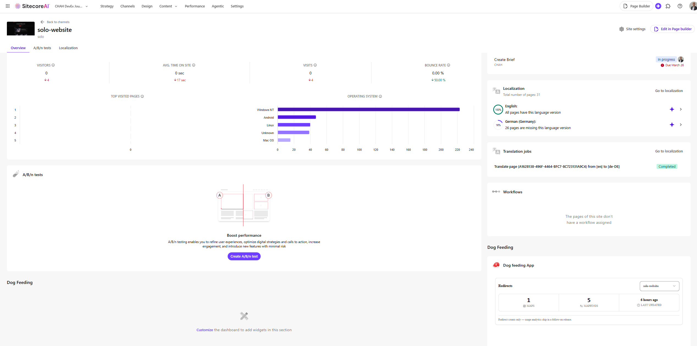
</p>

### Context Panel (inside the Pages editor)

For the page being edited, lists every redirect that affects it (where this page is the source OR target by exact-string match), grouped by parent Redirect Map. Add, edit, and delete inline without leaving Pages.

<p align="center">
  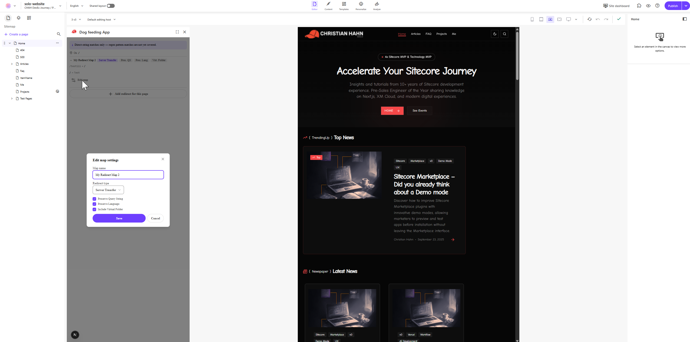
</p>
<p align="center">
  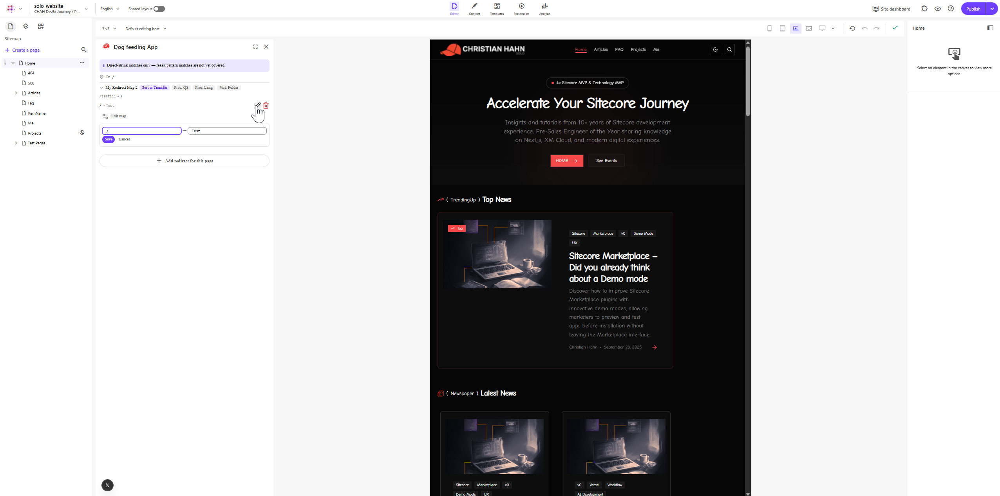
</p>
<p align="center">
  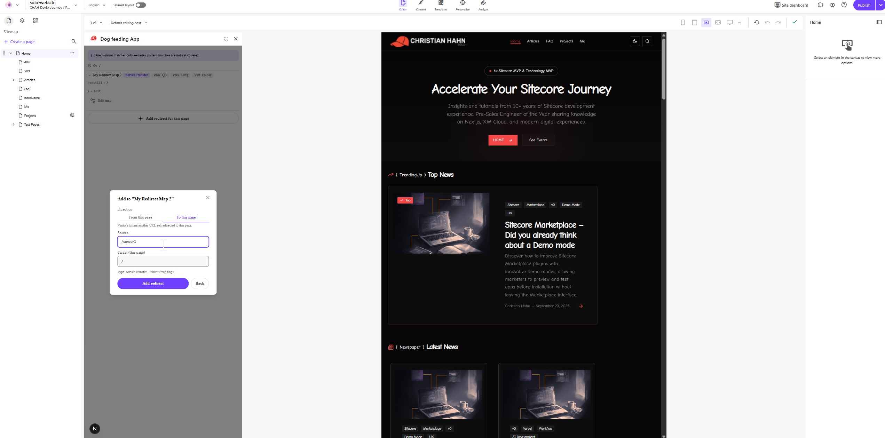
</p>
<p align="center">
  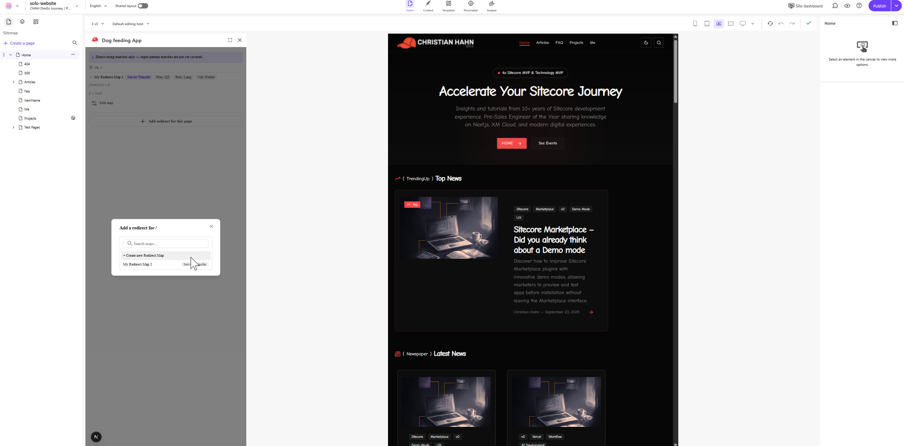
</p>

### Full Page (the power-user workshop)

Site-collection + site picker drives a virtualized list of Redirect Maps. Per map: editable name, redirect type, three flags, plus a mappings table with inline add/edit/delete and drag-reorder. Import / export JSON keyed by Sitecore item GUID with a per-conflict three-action picker.

<p align="center">
  
</p>
<p align="center">
  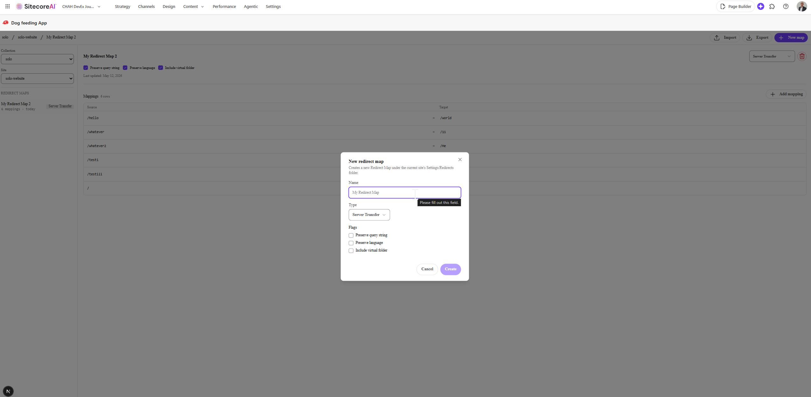
</p>
<p align="center">
  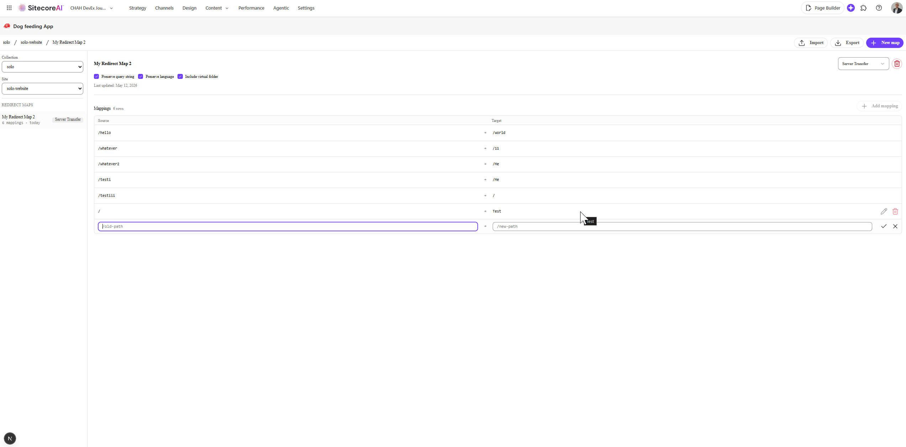
</p>
<p align="center">
  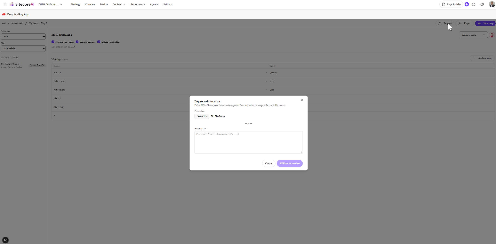
</p>
<p align="center">
  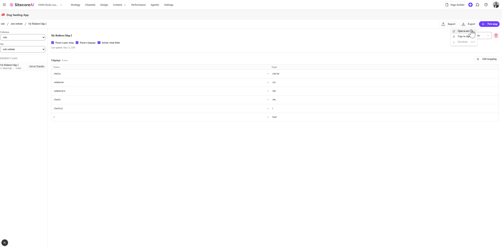
</p>

## Known limitations (PRD-000 MVP)

- **`en` only.** Multilingual CRUD deferred to PRD-001. [ADR-0010](project-planning/ADR/adr-0010-mvp-language-scope-en-only.md)
- **Exact-string match in the Context Panel.** Regex source rows are skipped. A non-dismissible banner makes this explicit in the UI. [ADR-0005](project-planning/ADR/adr-0005-context-panel-exact-match-only.md)
- **No concurrent-edit detection.** Last writer wins. [PRD § R10]
- **No usage analytics.** Counts and last-updated timestamps only. Analytics deferred to PRD-001.
- **Cloud Portal does not pass per-site context to Dashboard Widget embeds.** The widget falls back to a site picker (operator's last pick persisted via `localStorage`).
- **Import on cross-tenant promotion mints fresh GUIDs** for `create` actions. The import summary calls this out per item.

## Smoke and validation

Before `/ship` the operator runs five real-tenant smoke checklists, all documented under [`site/docs/`](site/docs/):

- [`registration.md`](site/docs/registration.md) — Cloud Portal Test App registration (one-time)
- [`smoke-crud.md`](site/docs/smoke-crud.md) — CRUD round-trip (m3)
- [`smoke-import-export.md`](site/docs/smoke-import-export.md) — Import / export round-trip (m4)
- [`smoke-live-walkthrough.md`](site/docs/smoke-live-walkthrough.md) — 5-minute live walkthrough (m5)
- [`host-frame-smoke.md`](site/docs/host-frame-smoke.md) — 5-axis pixel comparison (m2)

Outcomes get recorded in `project-planning/workflow/current-run.json` → `smoke_outcomes` and are required before `/ship` can flip status to `shipped` (vs `shipped_with_caveats`).

## Roadmap

- **PRD-001** — Multilingual CRUD + usage analytics (Upstash + head-app instrumentation).
- **PRD-002** — Sync-back of consolidated counters to the Sitecore Redirect Map template.
- **Later** — Regex-aware Context Panel matching, concurrent-edit detection, bulk operations, audit log, public Marketplace submission. See PRD-000 § 15 Future Opportunities.

## License

Internal — distribution policy TBD.
