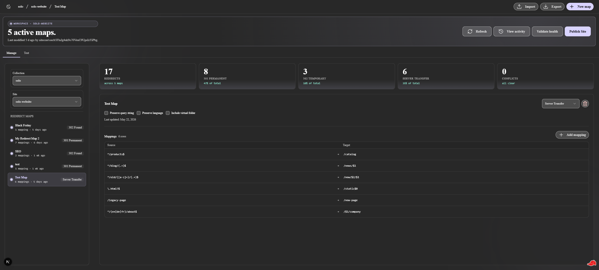
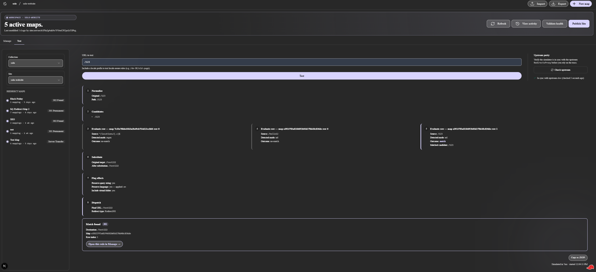
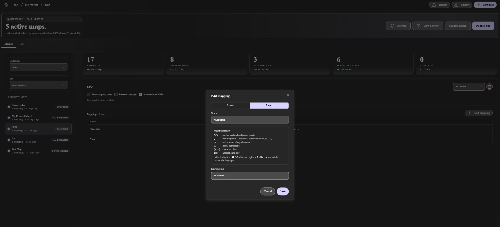
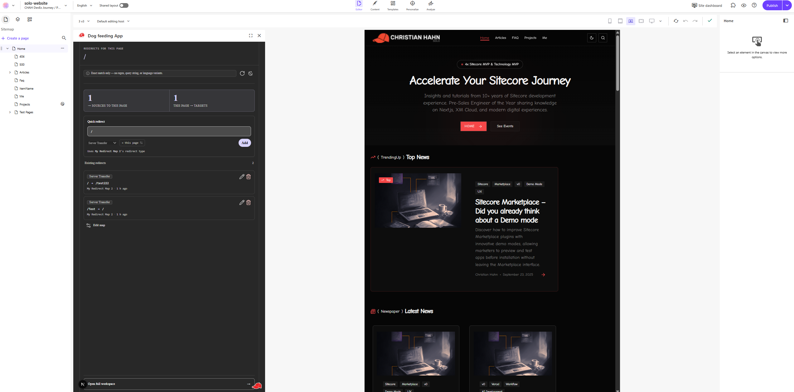
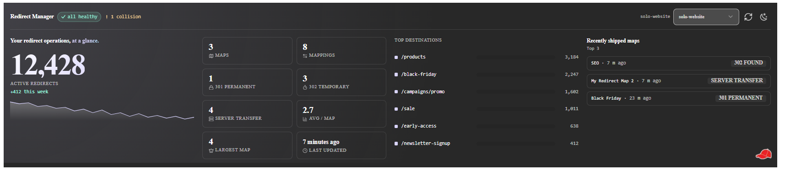
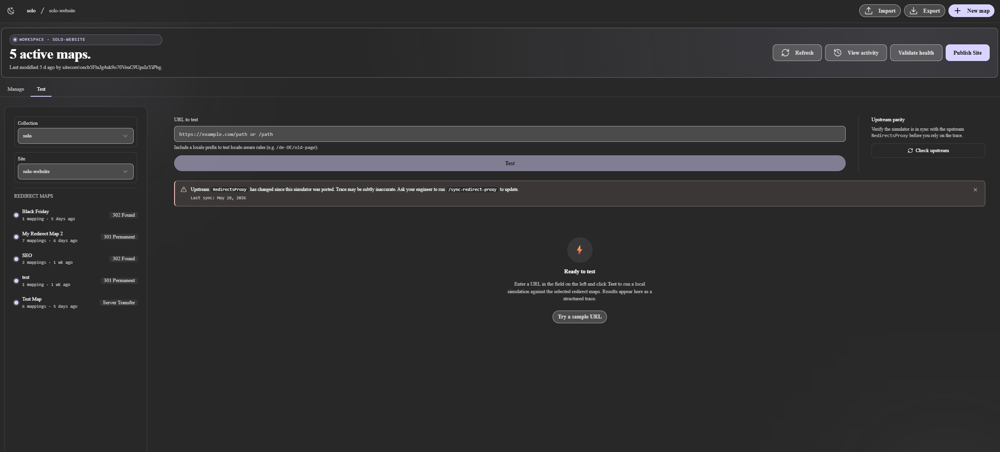

#  Redirect Manager

**Author:** [Christian Hahn](https://www.linkedin.com/in/christian-hahn-solo/) — _Technical Product Manager DevEx & SDKs @ Sitecore_

A Sitecore Marketplace client-side app that gives content authors and site managers a purpose-built UI for redirect operations across a SitecoreAI tenant. Replaces the Content Editor workflow for managing items under `/sitecore/content/{COLLECTION}/{SITE}/Settings/Redirects/*` and surfaces redirects inside the Pages editor, on the site dashboard, and on a dedicated full-page workshop.

<p align="center">
  
</p>

## What's new

The workspace has grown into a real authoring + testing surface this quarter:

- **Regex source mode + Test tab** — author redirect rules with anchors, capture groups, character classes and alternation; save-time `try { new RegExp() }` validation rejects bad patterns before they reach Sitecore. The Test tab dry-runs any URL through a local simulator that mirrors the upstream Content SDK `RedirectsProxy` step-by-step (normalize → candidates → per-row evaluation → substitute → flag effects → dispatch) and shows the matched row, final URL, and redirect type. No more publish-and-pray.
- **Upstream parity check** — an on-demand "Check upstream" button on the Test tab confirms the local simulator is in sync with upstream Sitecore/content-sdk; when upstream moves, an inline banner tells you the trace may be subtly inaccurate and points you at a one-shot fix. The dev-time `/sync-redirect-proxy` Claude Code slash command in this repo (see [Dev-time tools](#dev-time-tools)) does the verbatim re-port for you.
- **Publish Site, wired end-to-end** — the workspace "Publish Site" button now triggers a real publish job against the SitecoreAI Publishing v1 API. Lightweight job polling, cross-session resume, and operator-readable job names so the job is recognizable inside SitecoreAI's publishing list.
- **V4 Blok Elevated redesign across all three surfaces** — frosted-glass workspace with a hero zone + 5-tile stat strip and a drifting plume backdrop on the Full Page; an always-visible inline Quick Redirect form replaces the old modal on the Context Panel; a Dashboard Widget with 8 real stat tiles, collision badge, top-destinations bar list, and recently-shipped panel.

See [CHANGELOG.md](CHANGELOG.md) for the per-release detail.

## What this does

Redirect Manager exposes three Cloud Portal extension points, all backed by Sitecore Authoring GraphQL:

- **Context Panel** — inside the Pages editor, lists every redirect affecting the current page (exact source/target match), with inline add / edit / delete.
- **Dashboard Widget** — at-a-glance tiles (Maps / Mappings / 301 / 302 / Server Transfer / Avg per map / Largest map / Last updated), collision badges, top-destinations bar list, and recently-shipped maps.
- **Full Page** — Two tabs:
  - **Manage** — virtualized Redirect Map list, full CRUD via the `EditRowModal` (Pattern / Regex mode toggle + save-time validation per PRD-004), drag-reorder, JSON import / export keyed by Sitecore item GUID, conflict resolver, and a real **Publish Site** button wired to the SitecoreAI Publishing v1 API (PRD-003).
  - **Test** — local simulation of how the Content SDK `RedirectsProxy` would evaluate a URL against the loaded redirect inventory; structured-card trace per pipeline stage; on-demand **Upstream parity** check that surfaces when the local simulator has drifted from upstream Sitecore/content-sdk (PRD-004 + PRD-005).

Redirects are shared across all language versions of a site — `UrlMapping` is a SHARED Sitecore field (no language axis). See [docs/features.md](docs/features.md) for per-surface deep-dives.

## Screenshots

**Full Page → Test tab** with structured trace (PRD-004) — paste a URL, the simulator walks through the same pipeline the upstream Content SDK `RedirectsProxy` would (normalize → candidates → per-row evaluation → substitute → flag effects → dispatch) and surfaces the matched row + final URL + redirect type. "In sync with upstream `dev`" inline status confirms the simulator is current (PRD-005):

<p align="center">
  
</p>

**Regex mode in `EditRowModal`** (PRD-004) — segmented Pattern / Regex toggle, save-time `try { new RegExp() }` validation, contextual regex cheatsheet for anchors / captures / character classes / `$siteLang` substitution:

<p align="center">
  
</p>

**Context Panel and Dashboard Widget** (PRD-002 carry-forward):

<p align="center">
  
</p>

<p align="center">
  
</p>

## Tech stack

| Layer | Choice |
|---|---|
| Scaffold | `sitecore:setup-marketplace-client-side` (Mode A) |
| Framework | Next.js App Router `next@16.x` + React 19 |
| SDK | `@sitecore-marketplace-sdk/client` + `@sitecore-marketplace-sdk/xmc` |
| UI | Blok primitives via shadcn registry, Tailwind v4, lucide icons |
| Data | Sitecore Authoring GraphQL via `xmc.authoring.graphql` |
| Publish | SitecoreAI Publishing v1 REST — server-side OAuth proxy route (ADR-0035) |
| State / forms | `react-hook-form`, `zod` v4, `sonner` |
| Lists / drag | `react-virtuoso`, `@dnd-kit/core` + `@dnd-kit/sortable` |
| Tests | Vitest + `@testing-library/react` + jsdom + `fast-check` |

Scaffold command and ADR: [ADR-0002](project-planning/ADR/adr-0002-marketplace-sdk-mode-a-scaffold.md).

## Quickstart

Marketplace apps require HTTPS — Cloud Portal enforces secure-context constraints. See the `sitecore:marketplace-sdk-testing-debug` skill for the full mkcert / Local Network Access setup.

1. **Install Node** — version pinned by `site/package.json` (Next 16 + React 19 toolchain).
2. **Install mkcert** — trusted root CA for `https://localhost`.
3. **Register a Cloud Portal Test App** — see [`site/docs/registration.md`](site/docs/registration.md). Map three extension points:
   - `xmc:pages:contextpanel` → `/context-panel`
   - `xmc:dashboardblocks` → `/dashboard-widget`
   - `xmc:fullscreen` → `/full-page`
4. **Provision a SitecoreAI tenant** with Authoring GraphQL write access on `Settings/Redirects` items.
5. **For Publish Site only** — register an automation client (`xmcloud.cm:admin` + `xmcpub.jobs.a:r` + `xmcpub.jobs.a:w`); see [docs/operations.md](docs/operations.md).

```bash
cd site
npm install
cp .env.example .env.local   # populate from Cloud Portal Test App
npm run dev                  # boots at https://localhost:3000
```

Open the registered Test App and navigate to any of the three extension-point routes.

### Common commands

```bash
npm run dev          # dev server with Turbopack
npm run build        # production build
npm run lint         # ESLint
npm run typecheck    # tsc --noEmit
npm run test         # Vitest single-pass
npm run test:watch   # Vitest watch mode
```

## Dev-time tools

The repo ships with Claude Code slash commands under [`.claude/commands/`](.claude/commands/) — they are auto-discovered when you open Claude Code at the product root. Today there is one:

### `/sync-redirect-proxy`

Resync the local `proxy-simulator.ts` with upstream Sitecore Content SDK `RedirectsProxy` after a drift signal. **Use when** the in-app drift banner on the Test tab says *"Upstream `RedirectsProxy` has changed since this simulator was ported"* — that signal means baseline SHAs in `site/lib/redirects/__fixtures__/upstream-snapshot.json` differ from upstream `dev`.

<p align="center">
  
</p>

What it does (procedural Markdown — Claude Code executes it step-by-step):

1. Reads the baseline SHAs from `upstream-snapshot.json`
2. Fetches latest upstream raw + commit SHA for both watched files (`packages/nextjs/src/proxy/redirects-proxy.ts` + `packages/core/src/tools/utils.ts`)
3. If SHAs already match → prints "Already in sync" and exits (idempotent)
4. Otherwise: proposes a **verbatim re-port** patch on `proxy-simulator.ts` via Claude Code's edit flow — you review each hunk inline
5. On accept: regenerates `__fixtures__/upstream-cases.json` via the committed AST extractor (`npm run extract:upstream-fixtures`)
6. Runs `npm test -- proxy-simulator` — must be GREEN before SHA bump
7. On green: bumps the SHAs + `retrievedAt` + `fileHash` in `upstream-snapshot.json`. Atomic state — failed tests leave simulator + snapshot consistent (no half-applied state)

**Commit the resulting diff** (simulator + snapshot + regenerated fixtures together) and push. The in-app baseline picks up the bump on the next deploy. See [ADR-0044](project-planning/ADR/adr-0044-upstream-snapshot-json-authoritative-track-main.md), [ADR-0045](project-planning/ADR/adr-0045-in-app-passive-detection-only-ai-dev-time.md), [ADR-0047](project-planning/ADR/adr-0047-slash-command-atomic-state-transitions-knowndivergences-escape-hatch.md) for the design rationale.

If a particular upstream change is one you deliberately do NOT want to port (rare — e.g. tied to a feature this app doesn't support), record it in the snapshot's `knownDivergences[]` array with `reason` + `upstreamSha` — the slash command honors it and skips proposing changes for that function.

## Project structure

```
products/redirect-manager/
├── README.md
├── CHANGELOG.md
├── .claude/
│   └── commands/
│       └── sync-redirect-proxy.md  ← dev-time slash command (PRD-005, see "Dev-time tools")
├── docs/
│   ├── architecture.md      ← system narrative + PRD-002/003 additions
│   ├── decisions.md         ← ADR summary table (ADR-0001 – ADR-0037)
│   ├── features.md          ← per-surface deep-dives with screenshots
│   ├── operations.md        ← known limitations + smoke checklists
│   └── screenshots/
├── pocs/                    ← POC clickdummies (PRD-000, PRD-002)
├── project-planning/        ← PRDs, ADRs, task breakdowns, manifests
└── site/                    ← implementation
    ├── app/
    │   ├── context-panel/
    │   ├── dashboard-widget/
    │   ├── full-page/
    │   └── api/publish/     ← server-side OAuth proxy (PRD-003)
    ├── components/
    ├── hooks/
    ├── lib/
    │   ├── sdk/             ← typed SDK wrappers
    │   ├── publish/         ← publish service module (PRD-003)
    │   ├── url-mapping/     ← parse + serialize per ADR-0008
    │   └── import-export/
    ├── styles/
    └── tests/
```

## Configuration

| Variable | Required | Description |
|---|---|---|
| `NEXT_PUBLIC_XMC_COMPONENT_HOST` | Yes | XM Cloud component host URL |
| `NEXT_PUBLIC_XMC_EDGE_URL` | Yes | Edge delivery URL |
| `SITECORE_PUBLISH_CLIENT_ID` | Publish only | OAuth client ID for SitecoreAI Publishing |
| `SITECORE_PUBLISH_CLIENT_SECRET` | Publish only | OAuth client secret |
| `NEXT_PUBLIC_SHOW_THEME_TOGGLE` | No | Set to `1` to show the 3-state theme toggle |

Copy `.env.example` to `.env.local` — all variables with defaults are pre-filled.

## Architecture in three paragraphs

The app is a **client-side Marketplace app (Mode A)**. Every Sitecore read/write call rides the operator's authenticated Cloud Portal session — no server-side OAuth proxy, no backend to provision, except for the single publishing carve-out below.

All redirect data flows through **Authoring GraphQL via `xmc.authoring.graphql`** — one canonical source for reads and writes. The `UrlMapping` field is a URL-encoded string of `source=target` pairs; the app parses, edits, and re-serializes it losslessly (property-based tested). JSON import / export uses a versioned schema (`redirect-manager/v1`) keyed by Sitecore item GUID.

**PRD-003 added one server-side route** (`app/api/publish/route.ts`) — a narrow carve-out from ADR-0002 documented in ADR-0035. It holds OAuth client-credentials and proxies to the SitecoreAI Publishing v1 API; all other Sitecore calls remain Mode A. The route includes lightweight job-status polling and cross-session resume so operators see live elapsed time and can reload the tab mid-publish without losing the in-flight job.

For the full narrative see [`docs/architecture.md`](docs/architecture.md). For the decision log see [`docs/decisions.md`](docs/decisions.md).

## Where to read more

| Document | Contents |
|---|---|
| [docs/architecture.md](docs/architecture.md) | Full system narrative, data flow, SDK wire shapes, PRD-002/003 additions |
| [docs/decisions.md](docs/decisions.md) | ADR summary table (ADR-0001 – ADR-0037) grouped by theme |
| [docs/features.md](docs/features.md) | Dashboard Widget / Context Panel / Full Page deep-dives with screenshots |
| [docs/operations.md](docs/operations.md) | Known limitations, smoke checklists, publish-credential setup |
| [CHANGELOG.md](CHANGELOG.md) | Per-PRD release notes and roadmap |
| [project-planning/ADR/](project-planning/ADR/) | Individual ADR files with full rationale |

## License

Internal — distribution policy TBD.
