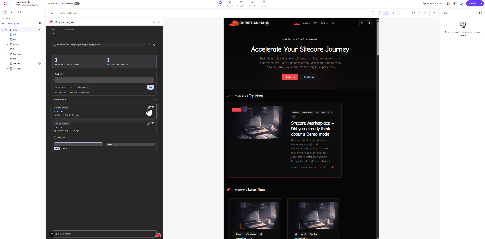
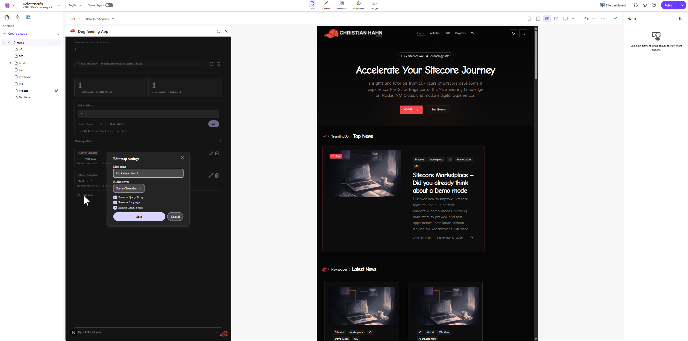
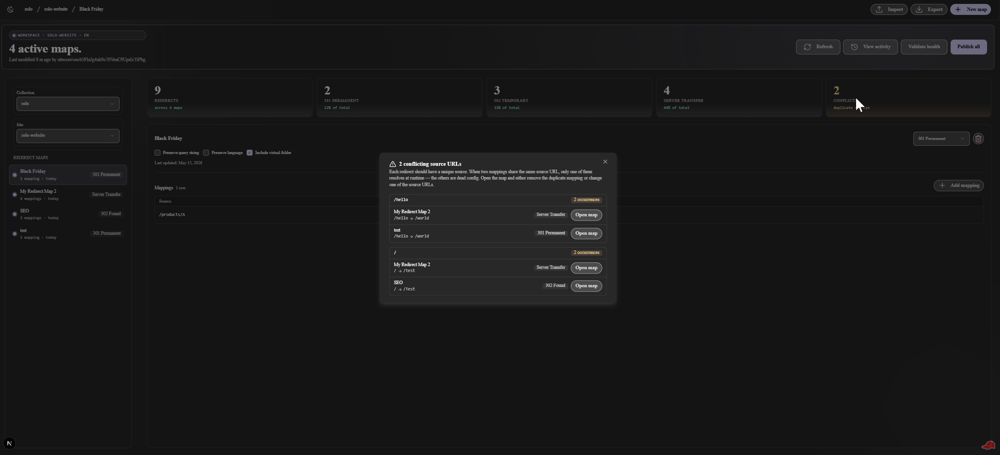
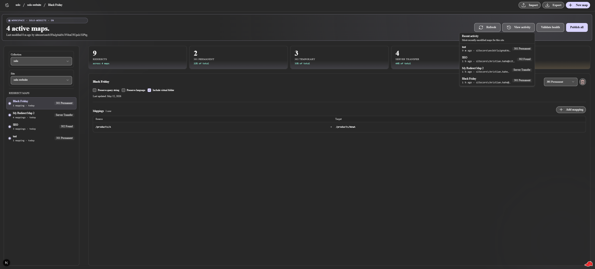
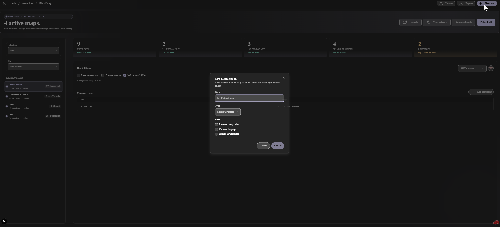
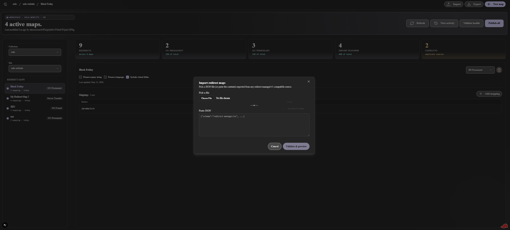
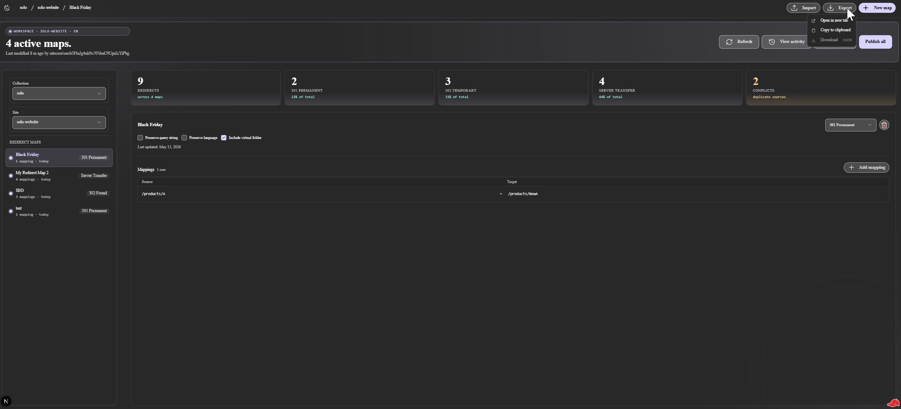

# Feature Tour

Per-surface deep-dives for Redirect Manager's three Cloud Portal extension points. For system-level architecture see [architecture.md](architecture.md); for the decision log see [decisions.md](decisions.md).

---

## Dashboard Widget

Embeds on the SitecoreAI site dashboard. Displays at-a-glance redirect health for a selected site.

**What it shows:**

- 8 real-data stat tiles: Maps / Mappings / 301 Permanent / 302 Temporary / Server Transfer / Avg per map / Largest map / Last updated
- Header badges: all-healthy placeholder + real source-URL collision count
- Top-destinations bar list (JS-animated, theme-independent `--color-primary-500`)
- Recently-shipped maps panel sourced from `map.updatedAt`
- Refresh button with full count-up + bar replay, no skeleton flicker on subsequent refreshes

**Site picker** — the Marketplace SDK does not surface "current site" to dashboard widget embeds. The widget includes a site picker at the top right; the operator's last selection persists via `localStorage`.

**Layout** — wide variant (≥960px) reflows to 4 columns; small variant collapses to a single column.

  

---

## Context Panel

Loads inside the Sitecore Pages editor for the page being edited. Shows every redirect that affects the current page and lets editors create, edit, and delete redirects without leaving Pages.

### General view

Page route as the gradient headline. Two-column hero splits matched mappings into *sources → this page* (other URLs that redirect here) and *this page → targets* (URLs this page redirects to). Each counter animates from 0 and replays on every refresh.

One-line match-scope notice shares a row with a refresh icon button (spins while loading, replays count-ups) and the theme toggle.

  

**Match scope** — exact-string source/target match only. Regex rows are skipped; language-prefixed routes are not normalized. A non-dismissible banner makes this explicit. See [ADR-0005](../project-planning/ADR/adr-0005-context-panel-exact-match-only.md) for rationale and [operations.md](operations.md) for the full limitation list.

### Quick redirect form

Always visible — no button click needed to start adding a redirect. Direction toggle flips between `→ this page` and `this page →`. When the current page appears in multiple Redirect Maps, a dropdown selects which map to add to. Duplicate-source guard checks for in-map collisions before writing.

  

### Edit map settings

The per-group **Edit map** button opens a modal to rename the map and adjust redirect type + three flags (Preserve query string, Preserve language, Include virtual folder). Mappings themselves are edited inline in the list.

  

---

## Full Page

The power-user workshop. Opened from the Cloud Portal full-screen extension point.

### General view

Workspace hero (real Last modified line + four hero CTAs), 5-tile stat strip (Redirects · 301 · 302 · Server Transfer · Conflicts), a virtualized rail of Redirect Maps, and a detail pane with the mappings table.

  

### Conflict management

When two mappings share the same source URL, only one resolves at runtime — the others are dead config. The Conflicts tile in the stat strip turns warning-toned and becomes clickable when collisions exist. It opens a dialog that groups every duplicate source across all maps for the selected site, with an **Open map** shortcut per occurrence.

  

### Recent activity

The **View activity** hero button opens a popover showing the 8 most-recently-modified maps for the current site (name + relative time + author), each clicking through to select the map in the rail.

  

### Create / edit maps and mappings

**New map** — dialog with name, redirect type, and three flags; creates the item under `{currentSite}/Settings/Redirects`.

  

**Inline mapping edit** — source and target inputs side by side with Save / Cancel; drag handle on each row for reordering inside the map.

### Import

Versioned `redirect-manager/v1` JSON keyed by Sitecore item GUID. Pick a file or paste the JSON; the next step previews per-item conflicts and offers a three-action picker (create / overwrite / skip). Cross-tenant imports always mint fresh GUIDs on `create` actions — the import summary calls this out per item.

  

### Export

Versioned JSON with three delivery modes: open in new tab, copy to clipboard, or download (queued for a follow-on PRD).

  

### Publish Site (PRD-003)

The **Publish Site** hero CTA triggers a site-wide Republish via the SitecoreAI Publishing v1 API. A confirmation dialog shows site name, locale count, and mode before firing. While the publish is in flight, the button shows elapsed time (`Publishing… Xs`); a terminal toast reports items-processed / items-failed. Cross-session resume re-finds the in-flight job if the tab is closed and reopened within 60 minutes.

Jobs appear in the SitecoreAI publishing list as `Redirect Manager — <collection>/<site> — <ISO timestamp>`.
